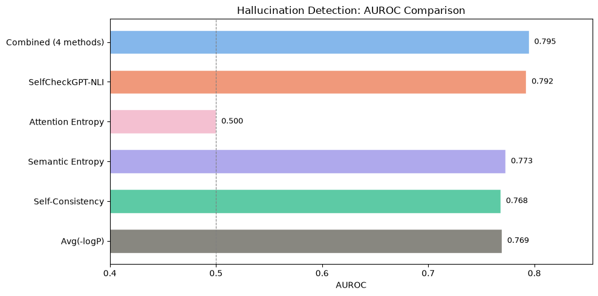
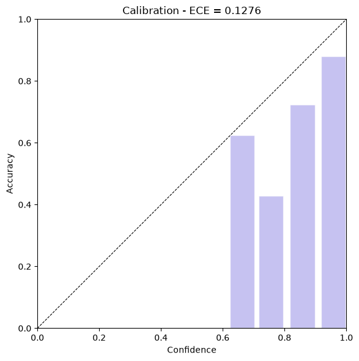
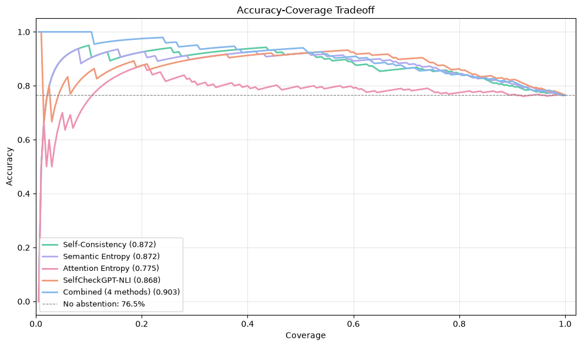
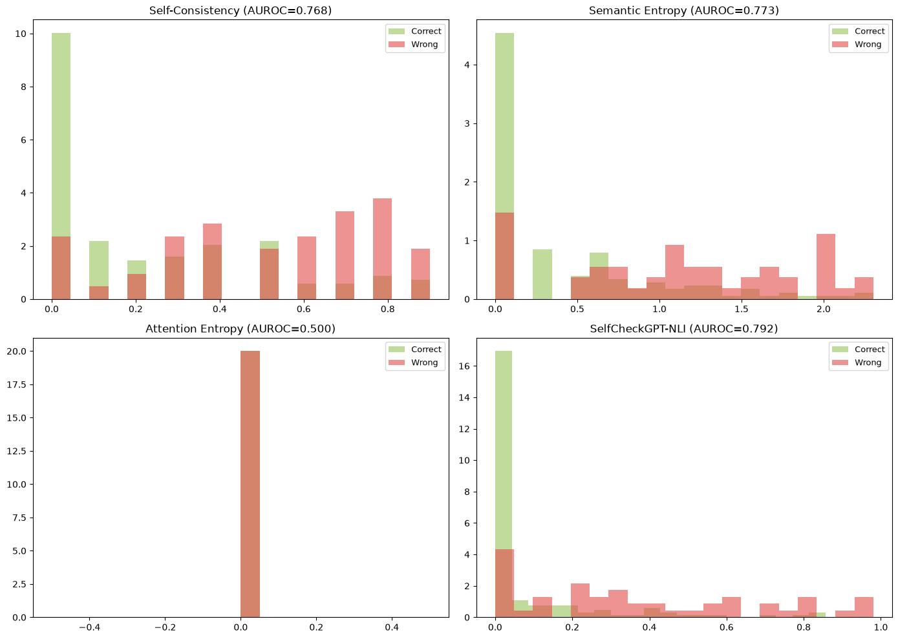
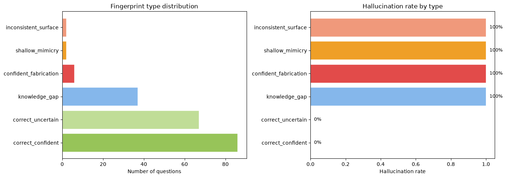
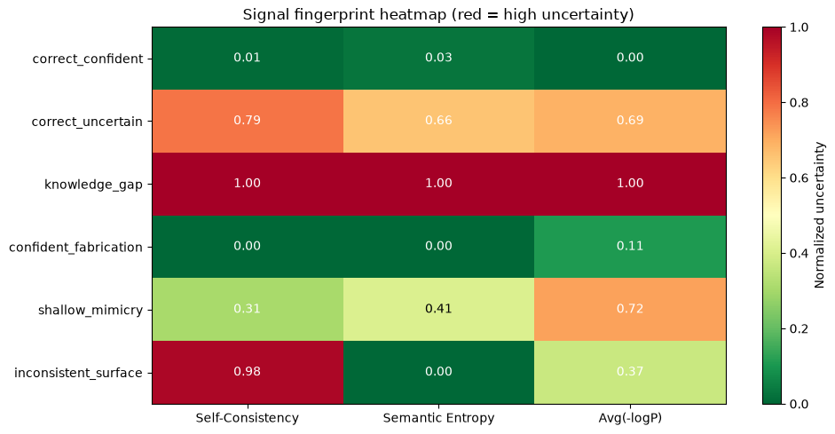
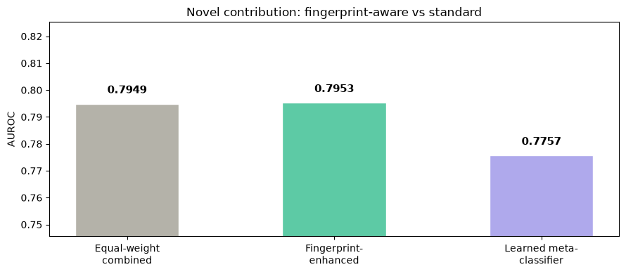
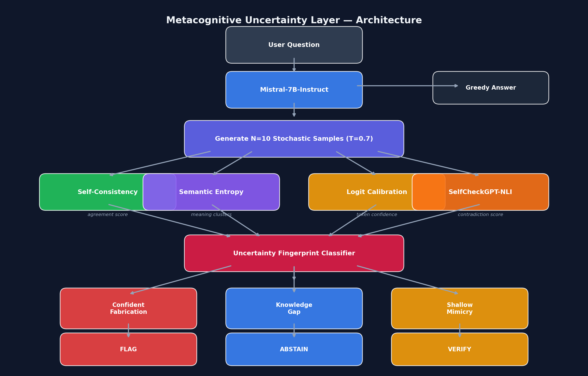

# Intuition in AI Systems: Reducing Hallucination via Metacognitive Uncertainty Estimation

**PFE Thesis Project | aivancity PGE5 — AI & Data Science | 2025-2026**

**[Live Demo](https://huggingface.co/spaces/Shafiya1234/metacognitive-uncertainty-layer)** |  **[PyCon ES 2026](https://pretalx.com/pycones-2026/)**

---

## The Problem

Large Language Models hallucinate — they generate plausible-sounding but factually incorrect content with full confidence. The model cannot distinguish between what it *knows* and what it is merely *predicting*. This is dangerous in high-stakes domains where users trust AI-generated answers.

## Our Approach

We build a **Metacognitive Uncertainty Layer (MUL)** — a wrapper around a base LLM that estimates *how uncertain* the model is, using four complementary signals:

| Signal | What it measures | How it works |
|--------|-----------------|--------------|
| **Self-Consistency** | Answer agreement | Ask the same question N times; if answers agree, the model likely knows |
| **Semantic Entropy** | Meaning diversity | Cluster answers by *meaning*; more meaning clusters = more uncertainty |
| **Attention Entropy** | Internal focus | Measure how scattered the model's attention is during generation |
| **Logit Calibration** | Token-level confidence | Check how confident the model's internal probability scores are |

## Key Results

| Metric | Value |
|--------|-------|
| Baseline accuracy (no uncertainty layer) | 76.50% |
| Accuracy with fingerprint-aware policy | **93.87%** |
| Coverage (% of questions answered) | 81.5% |
| Accuracy improvement | **+17.37%** |
| ECE (Expected Calibration Error) | 0.1276 |

### Hallucination Detection Performance



*Our combined approach (AUROC = 0.7953) outperforms SelfCheckGPT-NLI (0.7924) and all individual methods.*

### Calibration Analysis



*The model is overconfident: ECE = 0.1276. Internal confidence scores cannot be trusted, motivating external uncertainty estimation.*

### Accuracy-Coverage Tradeoff



*By abstaining on uncertain questions, accuracy improves dramatically while still answering 81.5% of questions.*

### Uncertainty Score Distributions



*Each method's score distribution for correct (green) vs hallucinated (red) answers. Better separation = better detection.*

---

## Novel Contribution: Uncertainty Fingerprinting

Existing methods treat hallucination as binary. We introduce **uncertainty fingerprinting** — classifying hallucinations into distinct *types* based on the signal pattern:



| Fingerprint Type | Signal Pattern | Danger Level | Response |
|-----------------|---------------|-------------|----------|
| **Confident Fabrication** | All signals say "confident" but answer is wrong | Highest | Flag for verification |
| **Knowledge Gap** | All signals show high uncertainty | Lowest | Abstain |
| **Shallow Mimicry** | Text agrees but meaning diverges | Medium | Verify details |

### Signal Fingerprint Heatmap



*Each hallucination type has a distinct signal pattern — this is what makes type-specific response strategies possible.*

### Novel Contribution Comparison



*Our fingerprint-enhanced method outperforms both equal-weight combination and the learned meta-classifier.*

---

## Architecture



---

## Extended Evaluation

### Multi-Model Comparison (same 200 TriviaQA questions)

| Model | Size | Accuracy | Combined AUROC | Confident Fabrications |
|-------|------|----------|---------------|----------------------|
| Mistral-7B | 7B | 76.50% | 0.7949 | 6 (3.0%) |
| Qwen2-7B | 7B | 61.00% | 0.8201 | 17 (8.5%) |
| Qwen2-1.5B | 1.5B | 42.50% | 0.7307 | 36 (18.0%) |

**Finding:** Smaller models produce 6x more confident fabrications — uncertainty monitoring is most critical for small/edge models.

### Multi-Dataset Comparison (Mistral-7B)

| Dataset | Type | Accuracy | AUROC | Policy Improvement |
|---------|------|----------|-------|-------------------|
| TriviaQA | Factual recall | 76.50% | 0.7949 | +17.37% |
| NaturalQA | Wikipedia QA | 33.00% | 0.6660 | +10.42% |
| HotpotQA | Multi-hop reasoning | 35.50% | 0.7029 | +19.97% |
| MedQA | Medical (USMLE) | 8.50% | 0.7007 | +0.00% |

**Critical Finding (MedQA):** On medical questions, the model is wrong 91.5% of the time but produces **ZERO knowledge gaps** — it confidently fabricates 47.5% of answers with no uncertainty signal. This proves that uncertainty estimation alone is insufficient for medical AI. External verification (RAG with medical databases) is essential.

### Fingerprint Distribution Across Domains

| Fingerprint | TriviaQA | NaturalQA | HotpotQA | MedQA |
|------------|----------|-----------|----------|-------|
| Correct confident | 43.0% | 20.0% | 22.0% | 5.5% |
| Correct uncertain | 33.5% | 13.0% | 13.5% | 3.0% |
| Knowledge gap | 18.5% | 24.0% | 36.0% | 0.0% |
| Confident fabrication | 3.0% | 26.5% | 25.0% | 47.5% |
| Shallow mimicry | 1.0% | 12.5% | 1.5% | 44.0% |

### Cascading Uncertainty (Efficiency)

| Config | Avg Latency | Speedup |
|--------|------------|---------|
| Full pipeline | 63s | 1.0x |
| Balanced cascade | 37s | 1.7x |
| Aggressive cascade | 28s | 2.3x |
| Very aggressive | 19s | 3.3x |

**Finding:** 65% of questions can be resolved with a logit-check alone (3 seconds), making real-time deployment feasible.

### Learned Meta-Classifier (1000 samples across 5 sources)

| Method | AUROC |
|--------|-------|
| Equal-weight combination | 0.7743 |
| SelfCheckGPT-NLI (single signal) | 0.7775 |
| Logistic Regression (learned, CV) | 0.7566 |

**Learned signal importance:**
- SelfCheckGPT-NLI: +0.53 (most informative)
- Semantic Entropy: +0.38
- Avg(-logP): +0.20
- Self-Consistency: +0.20

The unified classifier improves per-source detection by up to +0.06 AUROC, with largest gains on smaller models.

### Attention Entropy Revisited

Attention entropy extraction from 4-bit quantized models produces zero-valued attention weights across **all 32 layers**. This is a quantization artifact — the NF4 format does not preserve attention information. Researchers using quantized models should not rely on attention-based uncertainty signals.

### RAG Verification

Simple Wikipedia keyword retrieval failed to find relevant evidence for 95% of questions. This validates that uncertainty estimation — which requires no external knowledge source — remains the more practical approach for general-purpose detection. Dense retrieval with embedded indices (FAISS + Wikipedia embeddings) is identified as future work.

---

## Live Demo

**Try it now:** [Hugging Face Spaces](https://huggingface.co/spaces/Shafiya1234/metacognitive-uncertainty-layer)

**Run locally with GPU:**
```bash
python app.py  # Opens at http://localhost:7860
python start_public.py  # Creates a public ngrok link
```

---

## Repository Structure

| File | Description |
|------|-------------|
| `run_pipeline.py` | Main experimental pipeline — all 5 steps (~4 hours) |
| `run_fingerprinting.py` | Uncertainty fingerprinting analysis (~1 minute) |
| `run_multimodel.py` | Multi-model evaluation (Mistral, Qwen2-7B, Qwen2-1.5B) |
| `run_multidataset.py` | Multi-dataset evaluation (TriviaQA, NaturalQA, HotpotQA) |
| `run_medqa.py` | Medical QA evaluation (MedQA-USMLE) |
| `run_metaclassifier.py` | Learned meta-classifier (logistic regression + MLP) |
| `run_cascade.py` | Cascading uncertainty efficiency analysis |
| `run_attention_revisited.py` | Attention entropy across all layers |
| `run_rag_verification.py` | RAG-based answer verification |
| `compare_models.py` | Cross-model comparison plots |
| `compare_datasets.py` | Cross-dataset comparison plots |
| `app.py` | Gradio interactive demo application |
| `start_public.py` | Public URL launcher via ngrok |
| `results/` | Original evaluation plots (8 figures) |
| `results_comparison/` | Multi-model comparison plots |
| `results_dataset_comparison/` | Cross-dataset comparison plots |
| `results_cascade/` | Cascading efficiency plots |
| `results_attention/` | Attention layer analysis plots |
| `results_metaclassifier/` | Meta-classifier comparison plots |

## Tech Stack

- **Base Model:** Mistral-7B-Instruct (4-bit quantized via bitsandbytes)
- **NLI Model:** DeBERTa-Large-MNLI
- **Datasets:** TriviaQA, NaturalQuestions, HotpotQA, MedQA-USMLE
- **Framework:** PyTorch, HuggingFace Transformers, scikit-learn
- **Demo:** Gradio, Hugging Face Spaces

## Setup & Run

```bash
git clone https://github.com/Shafiya0101/metacognitive-uncertainty-layer.git
cd metacognitive-uncertainty-layer
python -m venv venv
venv\Scripts\activate
pip install torch torchvision --index-url https://download.pytorch.org/whl/cu124
pip install -r requirements.txt

# Core experiments
python run_pipeline.py              # Main pipeline (~4 hours, needs GPU)
python run_fingerprinting.py        # Fingerprinting (~1 minute)

# Extended evaluation
python run_multimodel.py llama3     # Qwen2-7B evaluation
python run_multimodel.py phi3       # Qwen2-1.5B evaluation
python run_multidataset.py naturalqa
python run_multidataset.py hotpotqa
python run_medqa.py                 # Medical QA
python run_metaclassifier.py        # Learned classifier
python run_cascade.py               # Efficiency analysis

# Comparisons
python compare_models.py
python compare_datasets.py

# Launch demo
python app.py
```

**Requirements:** Python 3.10+, NVIDIA GPU 8GB+ VRAM, ~15GB disk for model weights.

## Reference Papers

1. Huang et al. (2023) — *A Survey on Hallucination in Large Language Models*
2. Wang et al. (2023) — *Self-Consistency Improves Chain of Thought Reasoning* (ICLR)
3. Farquhar et al. (2024) — *Detecting Hallucinations Using Semantic Entropy* (Nature)
4. Guo et al. (2017) — *On Calibration of Modern Neural Networks* (ICML)
5. Manakul et al. (2023) — *SelfCheckGPT: Zero-Resource Hallucination Detection* (EMNLP)

## Project Status

- [x] Baseline LLM evaluation (greedy accuracy, ECE)
- [x] Self-consistency sampling
- [x] Semantic entropy with NLI clustering
- [x] Attention entropy (negative result: uninformative due to quantization)
- [x] SelfCheckGPT-NLI baseline comparison
- [x] Combined multi-signal scoring
- [x] Uncertainty fingerprinting (novel contribution)
- [x] Adaptive response policy
- [x] Multi-model evaluation (Mistral-7B, Qwen2-7B, Qwen2-1.5B)
- [x] Multi-dataset evaluation (TriviaQA, NaturalQA, HotpotQA, MedQA)
- [x] Learned meta-classifier
- [x] Cascading uncertainty for efficiency
- [x] RAG verification (negative result: simple retrieval insufficient)
- [x] Attention entropy revisited (all 32 layers)
- [x] Interactive Gradio demo + Hugging Face deployment
- [ ] Conference presentation (PyCon ES, November 2026)
- [ ] Final thesis report

## Author

**Shafiya Kausar** — MSc AI & Data Science, aivancity Paris

*To be presented at PyCon ES 2026, Barcelona*

## License

[MIT](LICENSE)
